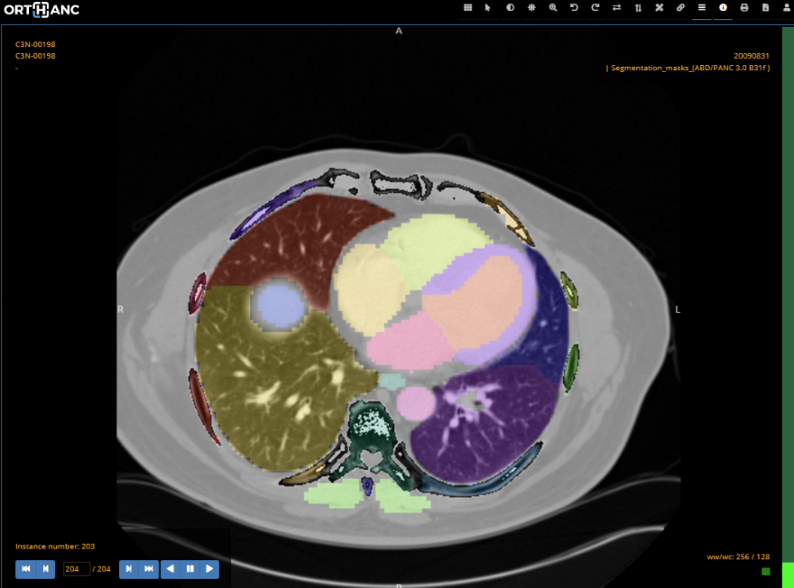

# **mercure-totalsegmentator**
 

Mercure module to deploy [TotalSegmentator](https://github.com/wasserth/TotalSegmentator) tool for segmentation of 104 classes in CT images. This module runs as a docker container in mercure, it can be added to an existing mercure installation using docker tag : *mercureimaging/mercure-totalsegmentator*.
 
The current version of the module is configured to run the TotalSegmentator at at lower resolution (3mm) so it is CPU compatible. To run at high resolution, minor code edits are required to remove the --fast TotalSegmentator option and enable GPU processing if desired.

 

# Installation
 

## Add module to existing Mercure installation
Follow instructions on [Mercure website](https://mercure-imaging.org) on how to add a new module. Use the docker tag *mercureimaging/mercure-totalsegmentator*.

 

## Quickly deploy test environment and run totalsegmentator module

 

Install [virtual box](https://www.virtualbox.org/) and [vagrant](https://www.vagrantup.com/) and follow jupyter notebook tutorial *tutorial_mercure-totalsegmentator.ipynb* above.

 

## Build module for local testing and development
1. Clone repo.
2. Build Docker container locally by running make (modify makefile with new docker tag as needed).
3. Test container :\
`docker run -it -v /input_data:/input -v /output_data:/output --env MERCURE_IN_DIR=/input  --env MERCURE_OUT_DIR=/output *docker-tag*`

 

# Output
 

Segmentations are written to specified output directory in three different formats :
- DICOM RTSTRUCT ( with segmentated VOI volume ( mm3 ) in description field )
- DICOM SEG
- DICOM RGB ( with masks of each VOI overlaid )

 
 

